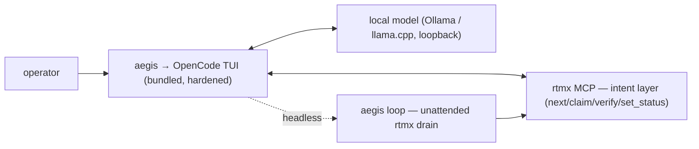

# CLAUDE.md — aegis-cli

Guidance for any agent (Claude, opencode, Goose) working in this repository.
Read this first. Then read the relevant skill in `skills/` before acting.

---

## 1. What aegis-cli is

aegis-cli is an **air-gap-native, top-tier agentic coding experience**. Its
centerpiece is the **OpenCode TUI** (MIT), driven by a **local model** (Ollama
spike / llama.cpp production, loopback only), with **rtmx as the intent layer**
(the requirements/traceability engine). Running `aegis` launches that TUI inside
a closed, ITAR-suitable environment.

aegis-cli **bundles and launches OpenCode; it does not fork or rebuild it.** It
owns the things a closed-enclave distribution needs *around* the harness:
air-gap hardening + egress default-deny, the rtmx intent loop (interactive in the
TUI and headless via `aegis run`), audit, metrics, calibration, and packaging.
OpenCode owns the agentic UX (tool-calling, file editing, the TUI); rtmx owns
intent (what to build, traced); the local model does the inference.



**Do not fork or rebuild OpenCode.** If a task feels like it needs tool-calling,
file editing, or sandboxing, that is OpenCode's job — configure/drive it, do not
reimplement it. aegis's code is the bundling, hardening, launch, rtmx wiring, and
loop around it.

### The three non-negotiables

1. **Closed by construction.** No component aegis ships, bundles, or launches may
   make a network call other than loopback to the local model endpoint. Egress is
   a build-failing condition, not a warning — including OpenCode's config (offline,
   telemetry off, no model-registry fetch). See `skills/airgap-hygiene`.
2. **Bundle, don't rebuild.** aegis owns distribution, hardening, launch, the rtmx
   intent loop, audit, metrics, egress guard, and config — and bundles OpenCode +
   the model + rtmx. It does not fork OpenCode or reimplement the harness.
3. **rtmx is the intent layer.** Work is scoped by human-authored, test-linked rtmx
   requirements — interactively in the TUI and headlessly via `aegis run` — one at
   a time, so a small local model succeeds and every change is independently
   verifiable. Closure is verify-driven (tests decide done).

---

## 2. The stack (as decided)

| Layer | Choice | Notes |
|---|---|---|
| Model | Gemma 4 26B A4B **or** Qwen3.6-35B-A3B | MoE, ~4B active. Decide by bake-off, not assumption. |
| Serving (spike) | Ollama | Fast iteration; localhost-bound; side-loaded GGUF. |
| Serving (production) | llama.cpp `llama-server` | From source, no telemetry. CPU on the Ryzen; Metal offload on the Mac (MLX faster, llama.cpp+Metal keeps air-gap parity). |
| Harness | opencode (default) / Goose (MCP-native contender) | Decide by bake-off. Both expose OpenAI-compatible + MCP. |
| Requirements | rtmx | Static Go binary, CSV-in-git, stdio MCP server. |
| Orchestrator | **aegis-cli (this repo, Go)** | Single static air-gappable binary. |

**Build targets.** Built **initially** on `linux-cpu` — Ryzen 5950X / Ubuntu / 64 GB —
and **ready** to target `darwin-metal` — MBP 16" M5 Max / 128 GB unified. One
`calibration.json` (with a `target` field) plus `internal/serving` drives both; the only
difference is at launch (CPU + `taskset` vs. all-layers-on-Metal, no pinning). Build and
validate on the Ryzen first; the Mac path is wired and waiting.

The serving layer is swappable behind the OpenAI-compatible endpoint, and the
harness is swappable behind an adapter (`internal/harness`). Treat both as
configuration, not as load-bearing assumptions in the loop logic.

### Resource model & tuning

The pattern is a **static conductor over heavy worker processes**: the aegis-cli
binary is one statically-linked Go binary, but the *system* is a single-host process
group — conductor plus inference server, harness, and rtmx — talking over local IPC
only. We do not link the inference engine into the binary; keeping the workers as
separate processes is what makes serving and harness swappable and keeps each
process's egress independently auditable.

Almost all compute lives in the inference worker. aegis-cli itself is I/O-bound and
uses negligible CPU, so "optimal resource use" is never about the orchestrator. The
binding constraint is **memory bandwidth** on both targets — the DDR4 bus feeding the
CPU on the Ryzen, the 614 GB/s unified memory feeding the Metal GPU on the Mac — so
two bandwidth-heavy stages running at once each get slower. Governance follows:

- **Calibrate, don't guess.** `scripts/bench.sh` auto-detects the target and sweeps the
  right knobs once — thread/batch with `-ngl 0` on `linux-cpu`, batch with all layers on
  Metal (`-ngl 999`) on `darwin-metal` — recording the winner (with a `target` field) in
  `deploy/llama-server/calibration.json`. `internal/serving` loads it at launch and emits
  the right flags per target. Uncalibrated launch is a hard error.
- **Place, don't schedule.** On `linux-cpu`, `internal/serving` pins inference to physical
  cores (`taskset`) and de-prioritises co-located workers (`nice`). On `darwin-metal` there
  is no `taskset` and pinning is not the lever — the GPU does the work; `nice` still applies.
  Either way this is OS primitives + config, not a custom scheduler — don't build one.
- **Separate in time.** The loop avoids overlapping generate and verify on the bus;
  phase separation beats core-partitioning here, on both targets.
- **Profile via metrics, not a separate tool.** WCR/TCR decompose into prefill /
  decode / verify / harness-overhead, emitted from `internal/metrics`. That breakdown
  is the profiler. See `skills/serving-calibration`.

---

## 3. Draft directory structure

```
aegis-cli/
├── CLAUDE.md                 # this file — agent guidance
├── README.md                 # human-facing: architecture + deprecation notice
├── AGENTS.md                 # harness-agnostic agent persona (build-to-spec)
├── docs/                     # operator + procurement docs (e.g. hardware-purchase-spec.md)
├── go.mod / go.sum
├── vendor/                   # vendored deps — offline builds, no live fetch
│
├── cmd/aegis/
│   └── main.go               # CLI entrypoint
│
├── internal/
│   ├── loop/                 # control loop: next → drive → verify → escalate; drain/park/breaker
│   ├── harness/              # adapter interface + opencode/, goose/ impls
│   ├── rtmx/                 # rtmx client (MCP stdio + CLI fallback)
│   ├── serving/              # endpoint config, health, calibration + launch/resource policy
│   ├── propose/              # human-gated decomposition (proposed children; aegis propose)
│   ├── audit/                # append-only audit log (claim/verify, who/what/when)
│   ├── metrics/              # per-run metric collection + report emit
│   └── config/               # config loading + validation (offline-safe defaults)
│
├── skills/                   # modular agent skills (see §6)
│   ├── rtmx-loop/
│   ├── build-to-spec/
│   ├── airgap-hygiene/
│   ├── go-conventions/
│   ├── context-discipline/
│   ├── metrics-eval/
│   ├── serving-calibration/
│   ├── unattended-operation/
│   └── decomposition/
│
├── deploy/
│   ├── llama-server/         # production serving: build flags + calibration.json (host-tuned)
│   ├── ollama/               # spike serving: localhost config, update-check off
│   ├── opencode/             # hardened opencode.json (offline=true, share/telemetry off)
│   ├── goose/                # hardened goose config (local extensions only)
│   └── firewall/             # default-deny egress rules
│
├── scripts/
│   ├── verify-airgap.sh      # packet-capture egress check (CI gate)
│   ├── bench.sh              # host calibration sweep (thread/batch → calibration.json)
│   └── ci-metrics.py         # compute per-run metrics from the golden set
│
├── eval/
│   ├── golden/               # frozen golden-set requirements + expected verify outcomes
│   └── baseline.json         # rolling metric baselines for regression gating
│
├── test/
│   └── ...                   # Go tests; loop integration tests with a stub harness
│
├── .rtmx/
│   └── database.csv          # aegis-cli's OWN requirements (dogfood from commit one)
│
└── .ci/
    └── pipeline.yml          # CI: build → unit → airgap gate → golden-set metrics
```

**Open source, no controlled data.** aegis-cli is developed in the open (public
`rtmx-ai/aegis-cli`). It is orchestrator *tooling*, not the mission work it drives: no
ITAR/CUI or otherwise controlled data, code, or requirements ever land in this repo. The
controlled work aegis-cli drives lives only on the internal/in-enclave git remote on the
closed host — never in the public org. The `.rtmx/database.csv` here tracks aegis-cli's
*own* development requirements (dogfood from commit one), which are themselves
uncontrolled.

---

## 4. Draft RTMX requirement categories

Categories are prefixes in `.rtmx/database.csv`. They are ordered by dependency so
the stack comes up incrementally — each category is buildable and verifiable before
the next depends on it. Every requirement links to at least one test so `rtmx verify`
can close it automatically.

| Prefix | Category | Brings up | Depends on |
|---|---|---|---|
| `SERVE` | Local serving | Endpoint healthy, correct quant, host-calibrated, launched under resource policy | — |
| `RTMX` | Requirements integration | MCP client; `next`/`claim`/`verify`/`status`; writeback | — |
| `HARNESS` | Harness integration | Adapter interface; headless drive; one impl green | `SERVE` |
| `LOOP` | Control loop | next → drive → verify → retry → escalate; resumable | `RTMX`,`HARNESS` |
| `AUDIT` | Recordkeeping | Append-only claim/verify log; who/what/when | `LOOP` |
| `GUARD` | Air-gap controls | Offline config; egress default-deny; zero-egress check | `HARNESS` |
| `METRIC` | Measurement | Golden set; per-run metrics; baselines; thresholds | `LOOP` |
| `PROPOSE` | Human-gated decomposition | Propose atomic children in a `proposed` state; inherit parent tests; human approves | `LOOP`,`AUDIT` |
| `CLI` | Command surface | `aegis run` (drain) / `run --once` / `status` / `verify-env` / `propose`; flags; config | `LOOP` |
| `BUILD` | Reproducible build | Vendored deps; static binary; offline build proof | `CLI` |
| `DOCS` | Operator docs | Deprecation notice; runbook; air-gap setup guide | `GUARD`,`CLI` |

### Example seed requirements

```
SERVE-001  Model endpoint answers a health probe within 2s        → test: serving/health_test
SERVE-002  Loaded model matches configured quant + digest          → test: serving/digest_test
SERVE-003  Calibration sweep emits a host-tuned config             → test: serving/calibrate_test
SERVE-004  Endpoint launches under calibrated args + target resource policy → test: serving/launch_test
SERVE-005  One config serves both linux-cpu and darwin-metal targets   → test: serving/target_test
RTMX-001   Client lists next available requirement via MCP         → test: rtmx/next_test
RTMX-002   Client claims + releases atomically (no double-claim)    → test: rtmx/claim_test
RTMX-003   verify result writes status back to CSV                 → test: rtmx/writeback_test
HARNESS-001 Adapter drives one requirement headless to a diff      → test: harness/drive_test
HARNESS-002 Malformed tool call is detected + retried, not crashed → test: harness/toolcall_test
LOOP-001   Full loop closes a trivial requirement end-to-end       → test: loop/e2e_test
LOOP-002   Failed verify retries up to N then escalates            → test: loop/escalate_test
LOOP-003   Loop is resumable after interruption (claim survives)   → test: loop/resume_test
LOOP-004   Verify does not run concurrently with generation        → test: loop/phasing_test
LOOP-005   `aegis run` drains the backlog until empty or stop       → test: loop/drain_test
LOOP-006   Unattended escalation parks (blocked+logged), not waits  → test: loop/park_test
LOOP-007   Circuit breaker halts after M consecutive failures       → test: loop/breaker_test
LOOP-008   Run budget caps requirements + wall-clock per session    → test: loop/budget_test
AUDIT-001  Every claim + verify emits an immutable log line        → test: audit/log_test
GUARD-001  Run with egress attempted → build fails                 → test: guard/egress_test
GUARD-002  opencode launches with offline config, no models.dev hit → test: guard/offline_test
METRIC-001 Golden set runs and emits all dashboard metrics         → test: metric/emit_test
METRIC-002 ACR below baseline threshold fails the run              → test: metric/regress_test
METRIC-003 Per-stage timing (prefill/decode/verify/harness) emitted → test: metric/stages_test
PROPOSE-001 `aegis propose` emits atomic children in proposed state → test: propose/emit_test
PROPOSE-002 Proposed reqs are not claimable until a human approves  → test: propose/gate_test
PROPOSE-003 Children inherit parent tests; depth + cap enforced     → test: propose/bounds_test
PROPOSE-004 Machine-authored provenance recorded in the audit trail → test: propose/provenance_test
CLI-001    `aegis verify-env` reports egress + traceability status → test: cli/verifyenv_test
BUILD-001  Binary builds with network disabled (vendored only)     → test: build/offline_test
```

---

## 5. CI metrics — how aegis-cli is measured each run

Every CI run executes the **golden set** (`eval/golden/`) through the real loop in a
network-captured sandbox, then computes the metrics below. This is intent-bench
methodology applied to aegis-cli itself. See `skills/metrics-eval` and
`scripts/ci-metrics.py`.

### Primary metric (north star)

- **ACR — Autonomous Completion Rate** = closed-by-verify ÷ attempted, with no human
  step. This is the number we optimize. Everything else explains movements in it.

### Dashboard (tracked every run, trended over time)

| Metric | Meaning | Direction |
|---|---|---|
| TCVR — Tool-Call Validity Rate | % well-formed tool calls | ↑ |
| FPVR — First-Pass Verify Rate | % closed without a retry | ↑ |
| MTC — Mean Turns-to-Close | agent round-trips per closed req | ↓ |
| WCR — Wall-Clock per Requirement | end-to-end latency (CPU-bound signal) | ↓ |
| TCR — Token Cost per Requirement | tokens (incl. reasoning) per closed req | ↓ |
| ESC — Escalation Rate | % requirements handed to a human | ↓ |

### Hard gates (any failure fails the build)

1. **EGRESS = 0.** Any network egress beyond loopback during the run fails CI.
   This is the ITAR control expressed as a test. Non-negotiable.
2. **TRACE = 100%.** `rtmx health` must pass — no orphaned requirements or tests.
3. **ACR regression.** ACR must not fall more than the configured delta below the
   rolling baseline in `eval/baseline.json` (catches model/harness/prompt regressions).

TCVR and MTC are the leading indicators when you swap model or harness in a bake-off:
a model change usually shows up in TCVR (does it emit valid calls?) and MTC (does it
wander?) before it shows up in ACR.

---

## 6. Skills index

Read the relevant skill before acting. Each lives in `skills/<name>/SKILL.md`.

- **rtmx-loop** — query, claim, verify, and write status back through rtmx safely.
- **build-to-spec** — the implementation discipline: one requirement, minimal change, tests, verify, release.
- **airgap-hygiene** — write code that makes zero external calls; vendored-only; how to prove it.
- **go-conventions** — aegis-cli Go style: static binary, no telemetry, match rtmx.
- **context-discipline** — keep context lean for a small CPU-bound model; prefer LSP/grep over file dumps.
- **metrics-eval** — run the golden set and compute/interpret the CI metrics.
- **serving-calibration** — tune the inference worker to the host, govern compute contention, profile per-stage timing.
- **unattended-operation** — drain the backlog safely while away: park-on-escalation, circuit breaker, run budget.
- **decomposition** — break coarse requirements into atomic children as human-approved proposals, never self-authored work.

---

## 7. Common commands

```bash
# build (offline, vendored)
GOFLAGS=-mod=vendor go build ./cmd/aegis

# calibrate the inference server to THIS host (run once; writes calibration.json)
scripts/bench.sh --model /models/your-model.gguf

# run one loop iteration against the configured harness + endpoint
aegis run --once

# drain the backlog unattended (bounded): park-on-escalation, breaker, run budget
aegis run --max 40 --break-after 3

# propose an atomic decomposition of a coarse requirement (human approves before it runs)
aegis propose LOOP

# verify the environment is closed + traceable before a real run
aegis verify-env

# compute metrics over the golden set (what CI runs)
python scripts/ci-metrics.py --golden eval/golden --baseline eval/baseline.json

# prove zero egress (CI gate)
scripts/verify-airgap.sh -- aegis run --once
```

## 8. Conventions

- Go, matching rtmx. Single static binary. No CGO unless a serving probe needs it.
- No telemetry, no analytics, no phone-home — ever, by construction.
- Dependencies are vendored. CI builds with the network disabled to prove it.
- Config defaults are offline-safe: if a setting could cause egress, its default is off.
- Audit log is append-only and stays in-enclave.
- This file and the skills are the contract. If reality diverges, fix the code or fix the doc — don't let them drift.

## 9. Deferred (evaluated, not tracked)

Recorded so these decisions aren't re-litigated or forgotten.

- **headroom (context compression).** Evaluated (Apache-2.0; MCP/proxy; compresses tool
  outputs/logs/RAG before the model). Deliberately **not adopted or tracked** as a
  requirement. Re-entry trigger: only if agentic round-trips prove a measured bottleneck
  (watch MTC). If so, bolt on its deterministic compressors for tool outputs via MCP — do
  not build an embeddings engine — lock down its egress vectors (PyPI update check,
  HF/cdn.pyke asset fetches) behind the GUARD gate, leave `headroom learn` off (it
  auto-edits CLAUDE.md/AGENTS.md, which conflicts with human-authored intent), and prove
  it on the golden set (WCR down, ACR/TCVR held) before adopting. See `context-discipline`.
