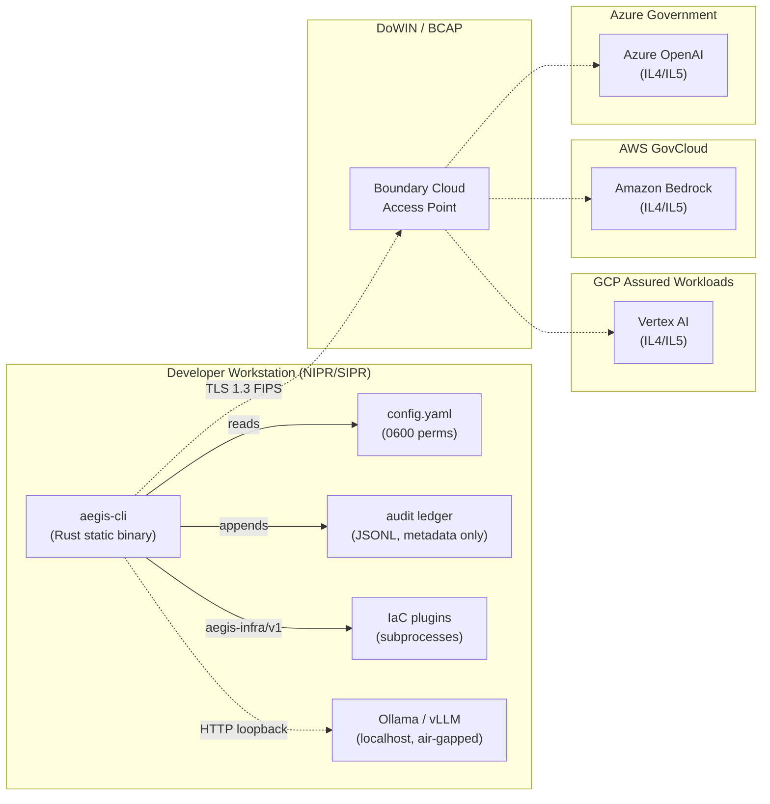
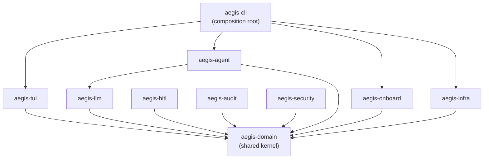
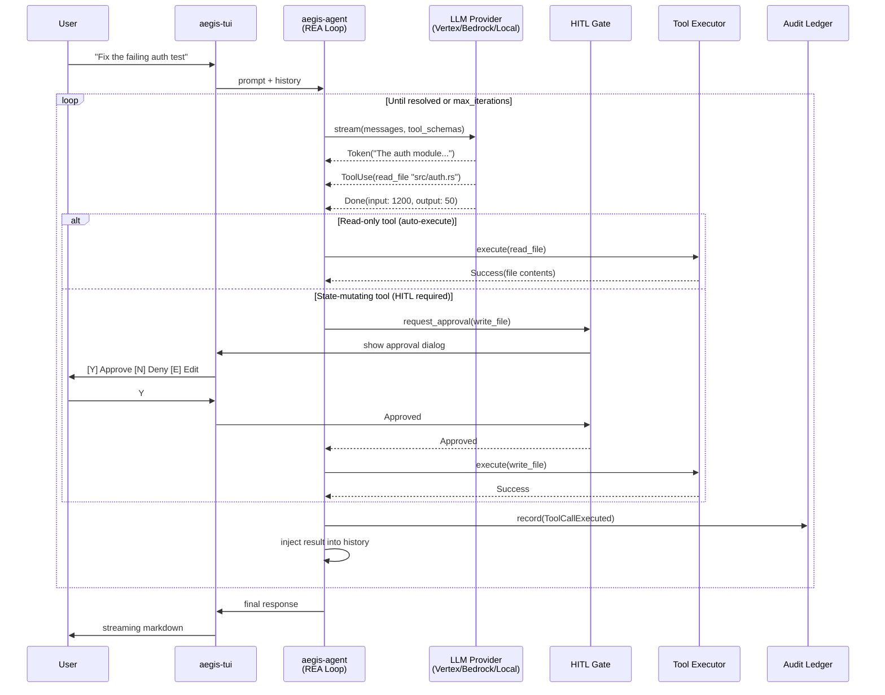
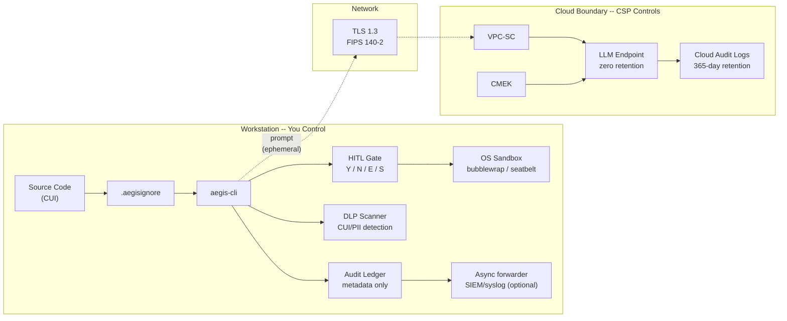
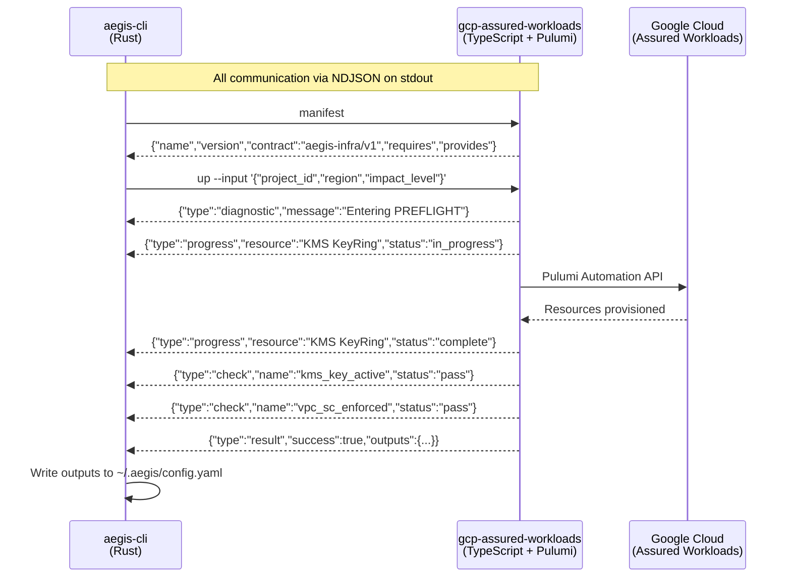

# aegis

[](https://github.com/rtmx-ai/aegis-cli/actions/workflows/ci.yml)
[](https://opensource.org/licenses/Apache-2.0)
[](https://www.rust-lang.org/)
[](#target-platforms)
[](#cloud-providers)

**An agentic AI coding assistant that runs where your code already lives -- inside the security boundary.**

Aegis is a terminal-native pair programmer built for defense and regulated environments. It delivers the full experience of a frontier AI coding assistant -- streaming responses, multi-step tool use, inline diffs, human-in-the-loop approval -- as a single static binary that connects only to LLM endpoints you control. GovCloud. Air-gapped. Your call.

---

## Why Aegis

Defense engineers are locked out of modern AI coding tools. Commercial platforms route source code through endpoints that violate NIST 800-171, CMMC 2.0, and DoD IL4/IL5 data handling requirements. Enterprise "AI solutions" lack terminal-native agentic capabilities. The result: compliance or productivity, pick one.

Aegis eliminates the trade-off. You control the compute, network, and data boundaries. The binary never phones home. The audit ledger never stores CUI.

## Features

- **Agentic loop** -- Read-Evaluate-Act cycle with streaming LLM responses, automatic tool dispatch, and iterative problem solving
- **Human-in-the-loop gate** -- Every state-mutating action (file writes, shell commands) requires explicit human approval before execution
- **Multi-cloud LLM backends** -- Vertex AI (GCP Assured Workloads), Amazon Bedrock (GovCloud), Azure OpenAI (Azure Government), all at IL4/IL5
- **Air-gapped operation** -- Run fully offline with Ollama or vLLM on disconnected networks; zero network egress
- **Immutable audit ledger** -- Append-only JSONL log of every session, tool call, and approval decision; metadata only, never CUI
- **Security filtering** -- `.aegisignore` with mandatory blocklist prevents `.env`, `*.pem`, `*.key`, and credential files from entering agent context
- **IaC plugin protocol** -- `aegis-infra/v1` protocol over NDJSON; plugins run as subprocesses, no Pulumi or Node.js required on the workstation
- **Terminal UI** -- ratatui-based interface with streaming markdown, inline diffs, and approval dialogs
- **Static binary** -- Single musl-linked binary for RHEL 8/9; MSVC build for Windows 10/11; no runtime dependencies
- **Requirements traceability** -- 159 requirements tracked via [RTMX](https://rtmx.ai), 12 BDD feature files, ~450 Gherkin scenarios

## Architecture

### System Overview

Aegis runs as a single static binary on a developer workstation (NIPR or SIPR). All sensitive state stays local. LLM endpoints are reached over TLS 1.3 through a customer-controlled boundary (DoWIN BCAP for IL4/IL5). For air-gapped environments, the binary connects to a local Ollama/vLLM endpoint and never touches the network.



### Workspace Crates



| Crate | Role |
|---|---|
| aegis-domain | Shared kernel: types, ports, events, errors |
| aegis-agent | REA loop, tools, orchestration (workstreams, waves, conflict matrix) |
| aegis-hitl | HITL gate: blocks mutating tools until human approves |
| aegis-llm | Provider abstraction: Vertex AI, Bedrock, Azure, Ollama/vLLM |
| aegis-tui | ratatui terminal UI: chat log, streaming markdown, approval dialogs |
| aegis-audit | Immutable JSONL ledger + async log forwarding to SIEM/syslog |
| aegis-security | .aegisignore, sandbox, transport, prompt-injection scan, CUI/PII DLP |
| aegis-infra | Plugin host: aegis-infra/v1 protocol, NDJSON event stream |
| aegis-onboard | aegis init: provider setup, config generation, mode selection |
| aegis-cli | Composition root: wires all crates, clap CLI entry point |
| aegis-test-support | Test infrastructure: mocks, fixtures, recording helpers |

### Read-Evaluate-Act Loop



### Security Boundaries



**On the workstation:** Source code, file contents, AI responses, shell output. Never leaves your machine.

**Crosses to cloud:** Prompt text only. Scanned for CUI markings and PII before transmission. Ephemeral, zero-retention. Encrypted in transit (TLS 1.3 FIPS). Encrypted at rest (CMEK). VPC Service Controls restrict API access to authorized networks.

**Audit ledger records:** Session start/stop, user identity, file paths accessed, token counts, HITL decisions. Never prompts, file contents, or AI responses. A `verify_redaction` scan proves no CUI/PII is present.

### Plugin Protocol (aegis-infra/v1)

Aegis does NOT embed Pulumi or provision cloud resources directly. It invokes IaC plugins as subprocesses via the aegis-infra/v1 protocol. Plugins are separate binaries built with the [@aegis/infra-sdk](https://github.com/rtmx-ai/aegis-infra-sdk).



**Subcommands:** `manifest`, `preview`, `up`, `status`, `destroy`

**Event types:** `progress`, `diagnostic`, `check`, `result`

**Lifecycle phases:** PREFLIGHT -> API_ENABLEMENT -> PROVISION -> VERIFY

**Reference plugin:** [gcp-assured-workloads](https://github.com/rtmx-ai/gcp-assured-workloads) -- provisions KMS, VPC, VPC-SC, audit bucket, IAM, and Vertex AI endpoint

**Plugin SDK:** [@aegis/infra-sdk](https://github.com/rtmx-ai/aegis-infra-sdk) -- implement 3 interfaces, call `createPluginCli(config)`

## Cloud Providers

| Provider | Auth | Region | Models |
|---|---|---|---|
| Vertex AI | GCP ADC | Assured Workloads (IL4/IL5) | Gemini 2.5 Pro, Flash |
| Amazon Bedrock | AWS SDK chain | GovCloud (US) | Claude Sonnet, Nova Pro |
| Azure OpenAI | Entra ID / API key | Azure Government | GPT-4o, GPT-4o mini |
| Local | None | N/A (air-gapped) | Any OpenAI-compatible (Ollama, vLLM) |

## Quick Start

### Prerequisites

- Rust stable toolchain (via [rustup](https://rustup.rs) or Homebrew)

### Build

```bash
cargo build --workspace
```

### Test

```bash
cargo test --workspace
```

### Run

```bash
cargo run --release -- init       # Configure provider and mode
cargo run --release               # Launch the TUI
```

### Development

```bash
cargo fmt --all                   # Format (required by pre-commit hook)
cargo clippy --workspace          # Lint (required by pre-commit hook)
```

Install git hooks for local quality gates:

```bash
./scripts/hooks/install.sh
```

## Install

### macOS (Homebrew)

```bash
brew tap rtmx-ai/tap
brew install aegis
```

### From source

```bash
git clone https://github.com/rtmx-ai/aegis-cli.git
cd aegis-cli
cargo build --release
```

The binary is at `target/release/aegis` (Linux/macOS) or `target/release/aegis.exe` (Windows).

RPM, DEB, and MSI installers will be available with future releases.

## Target Platforms

| Platform | Target | Delivery |
|---|---|---|
| RHEL 8/9 | `x86_64-unknown-linux-musl` | RPM, standalone static binary |
| macOS | `x86_64-apple-darwin`, `aarch64-apple-darwin` | Homebrew |
| Ubuntu/Debian | `x86_64-unknown-linux-gnu` | DEB, standalone binary |
| Windows 10/11 | `x86_64-pc-windows-msvc` | MSI, standalone EXE |

**Connected mode** (NIPR/DIB): Routes to GovCloud endpoints. `aegis init` provisions the cloud boundary via IaC plugin.

**Air-gapped mode** (SIPR): `aegis init --local` configures Ollama or vLLM. Zero network egress.

## Project Status

- 11 workspace crates, all compiling and tested
- 159 tracked requirements across 11 categories
- 12 BDD feature files with ~450 Gherkin scenarios
- CI pipeline: format, lint, unit tests (Linux + Windows), integration tests, doc tests, coverage, license/advisory audit, binary builds (musl + MSVC)
- Pre-commit and pre-push hooks mirror CI locally

## License

Apache 2.0. See [LICENSE](LICENSE).
