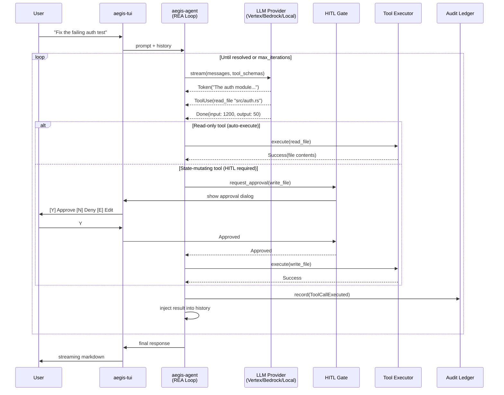
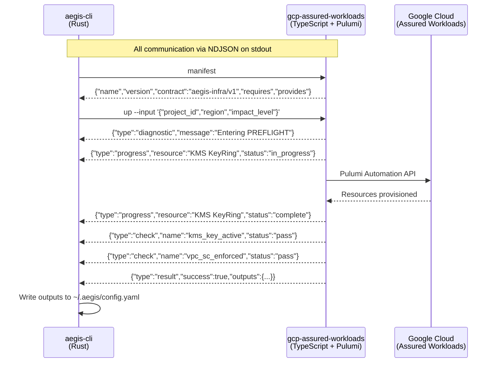
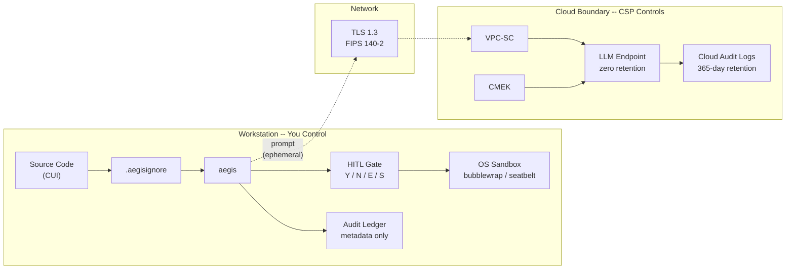
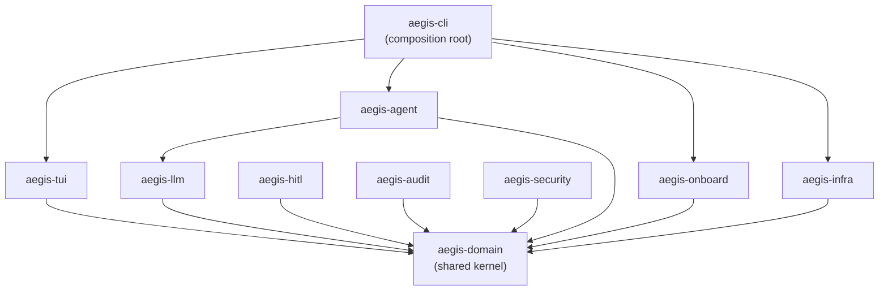

# aegis-cli

[](https://github.com/rtmx-ai/aegis-cli/actions/workflows/ci.yml)
[](https://opensource.org/licenses/Apache-2.0)
[](https://www.rust-lang.org/)
[](#target-platforms)
[](https://rtmx.ai)
[](#cloud-infrastructure)

A terminal-native agentic AI pair programmer for Controlled Unclassified Information (CUI) environments. Built for software engineers in the Department of War and the Defense Industrial Base (DIB).

Aegis gives you the developer experience of a frontier AI coding assistant -- streaming responses, tool use, inline diffs, human-in-the-loop approval -- while you maintain complete control over the compute, network, and data boundaries that underpin the interaction.

## The Problem

Defense engineers are cut off from modern AI coding tools. Commercial platforms like Claude Code and Cursor route code through endpoints that cannot satisfy NIST 800-171, CMMC 2.0, or DoD IL4/IL5 data handling requirements. Enterprise "AI solutions" lack terminal-native agentic capabilities. The result: defense engineers choose between compliance and productivity.

## The Solution

Aegis is a single static binary that runs on your workstation and connects to LLM backends you control:

- **Connected mode**: Route prompts through GCP Assured Workloads, AWS GovCloud, or Azure Government endpoints -- IL4/IL5 compliant, CMEK-encrypted, zero-retention.
- **Air-gapped mode**: Run entirely offline with local models (Ollama, vLLM) on SIPR or other disconnected networks.

Every agent action -- file reads, code writes, shell commands -- passes through a human-in-the-loop gate and is logged to an immutable local audit ledger. No CUI is ever persisted in the ledger; only metadata.

## Architecture

### System Overview


### Read-Evaluate-Act (REA) Loop



### Plugin Protocol (aegis-infra/v1)

Aegis does NOT embed Pulumi or provision cloud resources directly. It invokes IaC plugins as subprocesses via the aegis-infra/v1 protocol. Plugins are separate binaries built with the [@aegis/infra-sdk](https://github.com/rtmx-ai/aegis-infra-sdk).



**Reference plugin:** [gcp-assured-workloads](https://github.com/rtmx-ai/gcp-assured-workloads) (8 GCP resources: KMS, VPC, VPC-SC, audit bucket, IAM config)

**Plugin SDK:** [@aegis/infra-sdk](https://github.com/rtmx-ai/aegis-infra-sdk) (shared lifecycle, protocol emission, health aggregation)

### Security Boundaries



**What stays on the workstation:** Source code, file contents, AI responses, shell stdout/stderr. Never transmitted to the audit ledger or cloud logs.

**What crosses to cloud:** Prompt text (ephemeral, zero-retention). Encrypted in transit (TLS 1.3 FIPS). Encrypted at rest (CMEK). VPC-SC restricts API access to authorized networks.

**What the audit ledger records:** Session start/stop, user identity, file paths accessed, token counts, HITL approval decisions. Never prompts, file contents, or AI responses.

### Workspace Crates



### TUI Layout

```
+------------------------------------------------------------------+
| aegis v0.1.0 | IL5 Assured Workloads (us-central1) | 14K tokens  |
+------------------------------------------------------------------+
|                                                                    |
|  You: Fix the failing tests in the auth module                     |
|                                                                    |
|  > Reading src/auth.ts (4.2KB)                                     |
|  > Reading src/auth.spec.ts (2.1KB)                                |
|                                                                    |
|  The auth module has two issues:                                   |
|  1. The token refresh logic doesn't handle expired refresh tokens  |
|  2. The test mock doesn't match the updated API response schema    |
|                                                                    |
|  --- src/auth.ts                                                   |
|  +++ src/auth.ts                                                   |
|  @@ -42,7 +42,9 @@                                                |
|  -  if (token.expired) {                                           |
|  +  if (token.expired || token.refreshExpired) {                   |
|  +    await revokeSession(token.sessionId);                        |
|  +    throw new AuthError('SESSION_EXPIRED');                       |
|                                                                    |
|  +----------------------------------------------------------+      |
|  | APPROVE CHANGE: src/auth.ts                               |      |
|  | [Y] Approve  [N] Deny  [E] Edit  [S] Skip                |      |
|  +----------------------------------------------------------+      |
|                                                                    |
+------------------------------------------------------------------+
| >                                                                  |
+------------------------------------------------------------------+
```

### Agentic Loop

The Read-Evaluate-Act (REA) loop:

1. **Read**: Bundle prompt, conversation history, and tool schemas into payload
2. **Evaluate**: Stream to LLM endpoint. Model returns `tool_use` for actions or `text` for responses.
3. **Act**: Route tool calls through HITL gate. Execute approved calls. Inject results into history.
4. **Loop**: Continue until prompt is resolved or user interrupts.

Tools are classified by risk:

| Tool | Risk | HITL Required |
|---|---|---|
| `read_file`, `list_dir`, `grep` | Read-only | No |
| `write_file`, `run_command` | State-mutating | Yes |

### LLM Providers

Provider abstraction via Rust trait with factory pattern:

| Provider | Auth | Gov Region | Models |
|---|---|---|---|
| **Vertex AI** | GCP ADC | Assured Workloads (IL4/IL5) | Gemini 3.1 Pro, Flash-Lite |
| **AWS Bedrock** | AWS SDK chain | GovCloud (US) | Claude Sonnet 4.5, Nova Pro |
| **Azure OpenAI** | Entra ID / API key | Azure Government | GPT-5.4, GPT-5.4 mini/nano |
| **Local** | None | N/A (air-gapped) | Any OpenAI-compatible (Ollama, vLLM) |

### Cloud Infrastructure

`aegis init` provisions a compliant cloud boundary by invoking an IaC plugin via the aegis-infra/v1 protocol. No Pulumi CLI or Node.js required on the developer workstation -- the plugin handles everything as a subprocess.

**GCP Assured Workloads (primary -- lowest cost):**
- Cloud KMS CMEK with 30-day rotation
- VPC with Private Google Access + VPC Service Controls perimeter
- Cloud Audit Logs to CMEK-encrypted Storage bucket (365-day retention)
- Vertex AI endpoint pinned to specific model version and US region

**AWS GovCloud (future):**
- AWS KMS CMK + VPC + PrivateLink to Bedrock + CloudTrail + S3

**Azure Government (future):**
- Key Vault + VNet + Private Endpoint to Azure OpenAI + Monitor + Storage

### Security Model

- **HITL enforcement**: All state-mutating tool calls require explicit human approval
- **OS sandboxing**: bubblewrap (Linux) / seatbelt (macOS) for command execution
- **.aegisignore**: Context filtering with mandatory blocklist (`.env`, `*.pem`, `*.key`, credentials)
- **Transport**: TLS 1.3 with FIPS 140-2 validated cryptography
- **Audit ledger**: Immutable `.jsonl` at `~/.aegis/logs/` -- metadata only, no CUI
- **Config**: `~/.aegis/config.yaml` with POSIX `0600` permissions, no secrets stored

### RTMX Integration

Aegis uses [RTMX](https://rtmx.ai) for requirements-driven, closed-loop verification. Requirements live in the repository at `.rtmx/database.csv` and are part of the agent's context.

When working on a requirement:
1. Agent reads the requirement and its BDD criteria from the RTMX corpus
2. Agent implements code linked to the requirement
3. Agent runs tests linked via RTMX markers (`// @req REQ-XXX-NNN`)
4. Agent updates requirement status and test results in the CSV
5. Audit ledger entries carry the `req_id` for end-to-end traceability

The agent refuses to mark a requirement complete without passing tests. This is the closed loop.

## Cost Analysis (10M tokens/month, IL4/IL5)

Assuming 3:1 input:output ratio (7.5M input, 2.5M output) at standard tier with sovereignty markups:

### Flagship models

| Cloud | Model | Base Cost | Sovereignty Markup | Infra | Total |
|---|---|---|---|---|---|
| GCP Assured Workloads | Gemini 3.1 Pro | $45/mo | +20% ($9) | ~$12 | **~$66/mo** |
| Azure Government | GPT-5.4 | $56/mo | +~25% ($14) | ~$21 | **~$91/mo** |
| AWS GovCloud | Claude Opus 4.6 | $100/mo | ~0% | ~$11 | **~$111/mo** |

### Cost-optimized models

| Cloud | Model | Base Cost | Sovereignty Markup | Infra | Total |
|---|---|---|---|---|---|
| GCP Assured Workloads | Gemini 3.1 Flash-Lite | $5.63/mo | +20% ($1.13) | ~$12 | **~$19/mo** |
| Azure Government | GPT-5.4 nano | $4.63/mo | +~25% ($1.16) | ~$21 | **~$27/mo** |

### Sovereignty markup details

| Cloud | Mechanism | Markup | Notes |
|---|---|---|---|
| GCP | Assured Workloads Premium (IL4/IL5) | +20% on all services | Flat, documented, predictable |
| Azure | Government regions | +15-40% (varies by deployment type) | Less transparent; Regional > Data Zone > Global |
| AWS | GovCloud (US) | ~0% (parity) | Token pricing matches commercial |

GCP is the cost leader even with the 20% Assured Workloads premium because Gemini's base per-token rates undercut the competition.

Note: Anthropic and the Department of War have a significant rift as of March 2026, which introduces procurement risk for Claude models in DoD environments beyond the pricing consideration.

## Trade Study Summary

Evaluated 10 open-source CLI tools. Key findings:

| Tool | License | Runtime | Static Binary | HITL | Multi-LLM | Air-Gap Ready |
|---|---|---|---|---|---|---|
| **Goose** (Block) | Apache-2.0 | Rust | Yes (musl) | Yes | Yes | Yes (documented) |
| Crush (Charm) | Apache-2.0 | Go | Yes (CGO_ENABLED=0) | Yes | Yes | Likely |
| Codex CLI (OpenAI) | Apache-2.0 | Rust | Yes (musl) | Yes | Limited | Partial |
| Cline CLI | Apache-2.0 | Node.js | No | Yes | Yes | No |
| Claude Code | **Proprietary** | Node.js | No | Yes | No | No |
| OpenCode (SST) | MIT | TS/Bun | No | Yes | Yes | No |

**Goose selected** for: static binary, OS-level sandboxing, ToolShim for local models, MCP reference implementation, Linux Foundation governance, Apache 2.0 license.

## Target Platforms

| Platform | Binary Target | Installer |
|---|---|---|
| RHEL 8/9 (x86_64) | `x86_64-unknown-linux-musl` | RPM, standalone binary |
| Windows 10/11 (x86_64) | `x86_64-pc-windows-msvc` | MSI, standalone EXE |

Both modes:
- **Connected** (NIPR/DIB): Routes to GovCloud endpoints. `aegis init` provisions cloud boundary via plugin.
- **Air-gapped** (SIPR): `aegis init --local` configures for Ollama/vLLM. Zero network egress.

## MVP Scope

The minimum viable product is:

1. **IaC-activated IL4/IL5 managed LLM backend** -- `aegis init` invokes the [gcp-assured-workloads](https://github.com/rtmx-ai/gcp-assured-workloads) plugin to provision a GCP Assured Workloads boundary with Vertex AI endpoint, CMEK, VPC-SC, and audit logging.
2. **Functional TUI** -- ratatui-based terminal interface with streaming markdown, inline diffs, HITL approval, and immutable audit ledger.
3. **Local model support** -- `aegis init --local` for air-gapped operation with Ollama.

Post-MVP: AWS GovCloud and Azure Gov plugins, RTMX closed-loop verification, sub-agents, OS sandboxing, multi-player via RTMX Sync.

## Requirements

159 requirements tracked via [RTMX](https://rtmx.ai) at `.rtmx/database.csv`. 12 BDD feature files with ~450 scenarios. 90 passing unit tests across 8 crates.

Run `rtmx status` for current state. Run `rtmx health` to check test coverage.

## License

Apache 2.0. See [LICENSE](LICENSE).
