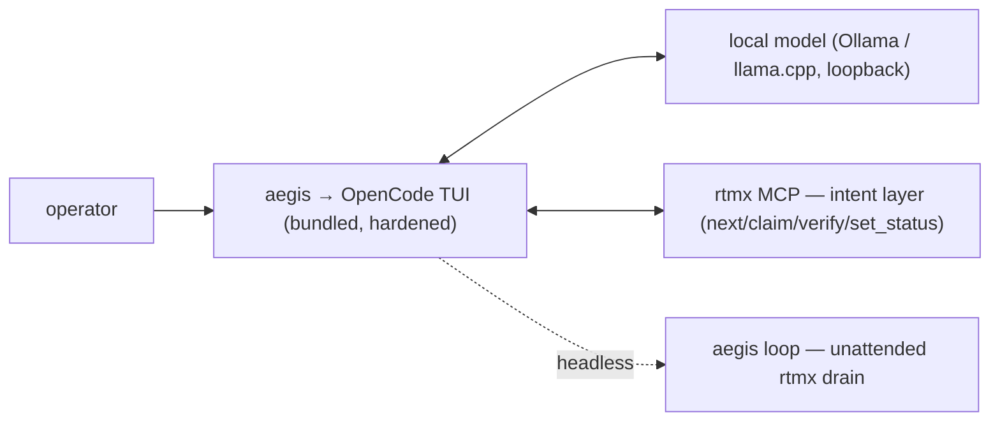

# aegis-cli

[](https://github.com/rtmx-ai/aegis-cli/actions/workflows/ci.yml)
[](https://github.com/rtmx-ai/aegis-cli/actions/workflows/ci.yml)
[](https://github.com/rtmx-ai/aegis-cli/blob/main/VERSION)
[](https://goreportcard.com/report/github.com/rtmx-ai/aegis-cli)
[](LICENSE)

<sub>CI status, statement coverage, and component version regenerate live on every green `main` build (`make badges` → `badges` branch); Go grade is served by goreportcard.com; license reads from `LICENSE` (Apache-2.0).</sub>

An **air-gap-native, top-tier agentic coding experience**. Its centerpiece is the
**OpenCode TUI** (MIT), driven by a **local model** (Ollama / llama.cpp, loopback)
with **rtmx as the intent layer**. Running `aegis` launches that TUI inside a
closed, air-gap-suitable environment. aegis **bundles and launches OpenCode; it
does not fork or rebuild it** — it owns the air-gap distribution, hardening, the
rtmx intent loop (interactive + headless `aegis run`), audit, and packaging.



Tool-calling, file editing, and sandboxing are **OpenCode's** job — aegis
configures and drives it, and never reimplements the harness.

---

## Setup

One command builds the full stack from pinned source (aegis + OpenCode +
llama.cpp), stages + verifies the model, calibrates serving to the host, and
smoke-tests the whole stack — run it on a connected build host:

```bash
./setup.sh --model /path/to/model.gguf
```

Then install + run in the closed enclave per [docs/operator-guide.md](docs/operator-guide.md):
`aegis` (the OpenCode TUI), `aegis run "<prompt>"` (one headless task), or
`aegis loop` (drain the rtmx backlog). Prerequisites + the tiered build cadence
are in [docs/requirements/build-cadence.md](docs/requirements/build-cadence.md).

---

## ⚠️ DEPRECATION NOTICE

The previous implementation was a **Rust** orchestrator built for the
**Google Cloud Assured Workloads / CUI** posture. It tried to be the harness and
did not pan out. That code is archived, unmaintained, on branch
**`legacy/rust-assured-workloads`**.

**This `main` is a ground-up, offline / air-gap-native Go rewrite.** It targets a
closed single host, vendors all dependencies, and makes zero network calls beyond
loopback. Do not port Rust assumptions forward; the architecture changed.

---

## The three non-negotiables

1. **Closed by construction.** No component aegis-cli ships or writes may make a
   network call other than loopback to the local model endpoint. Egress is a
   *build-failing* condition, not a warning.
2. **Thin-orchestrator discipline.** aegis-cli owns only: the loop,
   retry/escalation policy, audit logging, metrics, and config. Everything else is
   delegated to the harness and serving layer.
3. **One requirement at a time.** The loop claims a single rtmx requirement, closes
   it, releases it, and moves on. Scope is narrowed so a small local model can
   succeed and every change is independently verifiable.

---

## The stack

| Layer | Choice | Notes |
|---|---|---|
| Model | Gemma 4 26B A4B **or** Qwen3.6-35B-A3B | MoE, ~4B active. Decide by bake-off. |
| Serving (spike) | Ollama | Fast iteration; localhost-bound; side-loaded GGUF. |
| Serving (prod) | llama.cpp `llama-server` | From source, no telemetry. CPU on Ryzen; Metal on Mac. |
| Harness | opencode (default) / Goose | Swappable behind `internal/harness`. Decide by bake-off. |
| Requirements | rtmx | Static Go binary, CSV-in-git, stdio MCP server. The closed-loop engine. |
| Orchestrator | **aegis-cli (this repo, Go)** | Single static air-gappable binary. |

**Build targets.** Validated first on `linux-cpu` (Ryzen 5950X / Ubuntu / 64 GB);
`darwin-metal` (MBP 16" M5 Max) is wired and waiting. One `calibration.json` (with a
`target` field) plus `internal/serving` drives both.

---

## Quickstart

```bash
# build (offline, vendored — proves no live fetch)
make build           # GOFLAGS=-mod=vendor go build ./cmd/aegis

# run the exact pipeline CI runs: build → vet → unit → airgap gate → golden metrics
make ci

# run one loop iteration against the configured harness + endpoint
aegis run --once

# verify the environment is closed + traceable before a real run
aegis verify-env

# drain the backlog unattended (bounded): park-on-escalation, breaker, run budget
aegis run --max 40 --break-after 3
```

---

## How RTMX drives the closed loop

rtmx is the **foundation** of this project's requirements tracking and closed-loop
verification — it is load-bearing, not decoration. The loop is:

1. **Claim.** `rtmx next` hands the loop the next claimable requirement; the claim is
   atomic (no double-claim) so runs are resumable.
2. **Drive.** The harness implements the minimal change and its tests for that one
   requirement.
3. **`rtmx verify`.** rtmx runs `go test -json ./...` and maps each result back to a
   requirement via its `test_module` (Go package) + `test_function` columns.
4. **Status writeback.** A passing mapped test closes the requirement in
   `.rtmx/database.csv`; a failure downgrades it. That writeback *is* the closed loop.

See progress at any time:

```bash
make rtm        # status + traceability matrix
make backlog    # prioritized backlog (PHASE=<n> to filter a phase)
rtmx health     # the TRACE=100% gate: no orphaned requirements or tests
```

`rtmx health` passing is a **hard CI gate**: traceability must be 100%.

---

## Air-gap / ITAR posture

aegis-cli is developed **in the open** (public `rtmx-ai/aegis-cli`) because it is
orchestrator *tooling*, not the mission work it drives. **No ITAR / CUI or otherwise
controlled data, code, or requirements ever land in this repo.** The controlled work
aegis-cli drives lives only on the internal in-enclave git remote on the closed host —
never in the public org. The `.rtmx/database.csv` here tracks aegis-cli's *own*
(uncontrolled) development requirements — dogfood from commit one.

Egress is treated as a control expressed as a test: any network call beyond loopback
during a run fails the build (`scripts/verify-airgap.sh`). Config defaults are
offline-safe — if a setting could cause egress, its default is off.

---

## Repository layout

See `CLAUDE.md` for the full architecture spec, requirement categories, and CI
metrics. Agent personas and the implementation discipline live in `AGENTS.md` and
`skills/`. Operator and procurement docs are in `docs/`.
