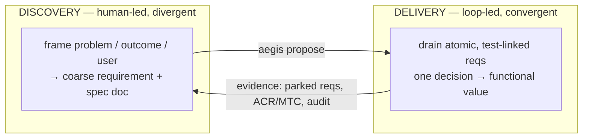

# Requirement Specification — Continuous Discovery & Framing

**Thread:** `FRAME-001..004` · **Phase 6 / sprint v0.6** · Status: PLANNED
**Tracked in:** `.rtmx/database.csv` · **Skills:** `decomposition`, `discovery` (this thread), `build-to-spec`, `metrics-eval`

## 1. Purpose & scope

The loop excels at *convergent delivery* — decompose to an atomic decision, close
it with a test, terminate in functional value. It says nothing about whether the
work is the *right* work. This thread integrates *divergent discovery/framing*
(design thinking) into sustained iteration **without** letting the machine author
or approve its own intent (the closed self-validating loop the architecture
exists to prevent — see `decomposition`).

The model is a coupled **double loop**:

Discovery feeds delivery through `aegis propose` + the human-gated `proposed`
state; delivery feeds discovery back through **parked requirements** and the
**metrics dashboard**. In scope: a skill that codifies the discipline, and the
machine-assist surface that turns delivery evidence into a reframe backlog and
enforces the spec-doc-as-define gate. Out of scope: any automation of framing
*decisions* — the human owns intent.

## 2. Definitions

- **Framing artifact** — the `docs/requirements/<thread>.md` spec (and the
  `requirement_file` column linking it) that states problem → outcome →
  acceptance. It is design thinking's *define* stage, made a backlog-admission gate.
- **Vertical slice** — a requirement that delivers user-observable value end to
  end (a `FEAT-*` scenario), not a horizontal layer. The unit of framing.
- **Reframe backlog** — requirements the loop **parked** (blocked): the spec was
  ambiguous or wrong, so they are discovery inputs, not delivery failures.
- **Unframed requirement** — one with no framing artifact: a hygiene violation.

## 3. Requirements

### REQ-FRAME-001 — Discovery/framing skill
**The repository shall** carry a `discovery` skill documenting the delivery↔
discovery double loop, the spec-doc-as-define gate, vertical-slice framing, the
evidence→reframe ritual, and the machine-proposes/human-approves guardrail.
*Rationale:* the discipline must be written contract, like every other skill.
*Acceptance:* `skills/discovery/SKILL.md` exists with valid frontmatter and
covers those topics. *Test:* `test::TestDiscoverySkillPresent`.
*Depends on:* REQ-PROPOSE-001.

### REQ-FRAME-002 — Discovery backlog from delivery evidence
**aegis shall** classify the rtmx backlog and surface **parked (blocked)**
requirements as the reframe backlog. *Rationale:* parked work is the empathize/
define input for the next framing cycle; the machine surfaces it, the human
reframes. *Acceptance:* `framing.Classify` returns blocked requirements as
reframe candidates (and delivered/in-flight/proposed lanes). *Test:*
`internal/framing::TestClassifyDiscoveryBacklog`. *Depends on:* REQ-RTMX-006.

### REQ-FRAME-003 — Framing hygiene
**aegis shall** flag requirements that lack a framing artifact (no
`requirement_file`/spec reference), so every atomic decision traces to an
outcome. *Rationale:* makes "terminates in functional value, traced to intent"
auditable rather than aspirational. *Acceptance:* unframed requirements are
reported; framed ones are not. *Test:* `internal/framing::TestFramingHygiene`.
*Depends on:* REQ-FRAME-002.

### REQ-FRAME-004 — `aegis frame` command
**`aegis frame` shall** report the five-way classification (delivered /
in-flight / parked / proposed / unframed) plus the reframe and unframed lists,
so an operator can run the evidence→reframe ritual. *Rationale:* the ritual
needs a one-command view; the loop never blocks on it. *Acceptance:* `aegis
frame` prints the classification against the live database. *Test:*
`cmd/aegis::TestFrameReports`. *Depends on:* REQ-FRAME-002, REQ-FRAME-003.

## 4. Design constraints

- **Assistive, never autonomous.** `aegis frame` and `aegis propose` surface and
  decompose; a human frames and approves. No command may admit, approve, or mark
  a requirement COMPLETE (closure stays verify-driven).
- Std-lib-only shipped binary; classification reads the CSV store (read-only).
- Hygiene is **reported, not a hard gate by default** — flagging legacy unframed
  requirements must not break `make ci`; the gate is advisory and trend-watched.

## 5. Verification & exit criteria

All four COMPLETE via `rtmx verify`, `rtmx health` HEALTHY at 100%, `make ci`
green. Build order: FRAME-001 (skill) ∥ FRAME-002 → FRAME-003 → FRAME-004.
